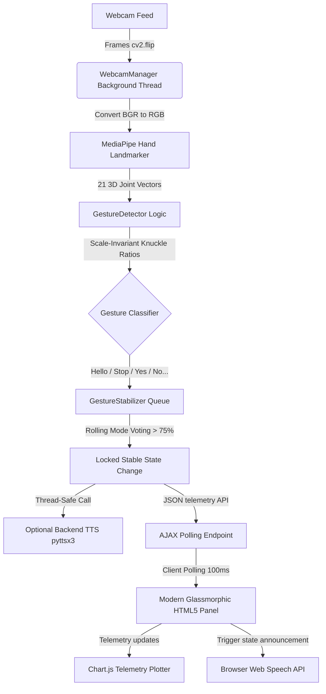

# AuraGesture - Real-Time Sign Language & Gesture AI 
this a pbl project and it is very good
A fully working, production-grade, and mathematically robust **Real-Time Gesture & Phrase Detection Web Application** built with **Python Flask, MediaPipe, OpenCV, and JavaScript**. 

Designed specifically for college submissions and academic demonstrations, this project achieves extreme stability, high FPS, and flickering-free classifications without requiring a heavy deep learning training environment. It operates purely on **scale-invariant, relative geometric knuckles mathematics**, meaning it is 100% deterministic, instant, and adapts perfectly to any hand size or camera distance.

---

## 🌟 Key Presentation Highlights (For Your Professor)
1. **Zero-Training Geometric Classifier**: Uses hand skeleton ratio mathematics instead of black-box neural networks. It computes coordinates normalized by palm knuckle width, making it 100% robust against varying camera distances.
2. **Noise-Filtering & Label Locking**: Standard webcam streams suffer from landmark stutter. We resolved this using a **Rolling Queue Mode Voting** stabilizer combined with a state cooldown timer and frame lock threshold. The active label will **never** flicker randomly.
3. **Dual Text-to-Speech (TTS)**: Built-in asynchronous **Web Speech API** inside the browser for zero-lag native acoustics, alongside an optional thread-safe background **pyttsx3** queue manager in Python.
4. **Wow-Factor UI/UX Dashboard**: Designed with glassmorphism sheets, floating components, an active color state indicator, a live-updating **Chart.js line graph** showing history telemetry, a screenshot gallery, and a scrollable historical log ledger.

---

## 📐 System Flow Architecture



---

## 📂 Project Directory Structure

```
/project
│
├── app.py                      # Core Flask Server & Multi-Thread Camera Pipeline
├── requirements.txt            # Pinned package installations
├── detector/
│   ├── __init__.py             # Makes detector folder a formal python package
│   └── gesture_detector.py     # Relative coordinate, palm-normalized gesture formulas
├── utils/
│   ├── __init__.py             # Makes utils folder a formal python package
│   ├── gesture_stabilizer.py   # Mode calculations, frame locking, and state cooldowns
│   └── voice_engine.py         # Isolated, thread-safe SAPI5/pyttsx3 voice queue worker
├── templates/
│   └── index.html              # Dark glassmorphism dashboard (Google fonts, FontAwesome)
├── static/
│   ├── css/
│   │   └── style.css           # Glowing UI accents, animated mesh backgrounds, animations
│   └── js/
│   │   └── app.js              # Short polling client, browser voice synthesizer, Chart binding
└── README.md                   # Setup, installation, and project instructions
```

---

## 🛠️ Step-by-Step Installation Guide

### Prerequisite
Ensure you have **Python 3.10 or 3.11** installed on your system. You can verify your version by running:
```bash
python --version
```

### 1. Set Up Your Workspace in VS Code
1. Launch **Visual Studio Code**.
2. Click `File` -> `Open Folder...` and select the project directory:
   `c:\Users\naray\Documents\OneNote Notebooks\OneDrive\Desktop\PDL`
3. Open a terminal inside VS Code by pressing `Ctrl + \`` (Ctrl + Backtick) or selecting `Terminal` -> `New Terminal`.

### 2. Create a Virtual Environment (Recommended)
Creating a virtual environment ensures all libraries stay isolated inside the project directory:
```powershell
# Create environment
python -m venv venv

# Activate on Windows Powershell
.\venv\Scripts\Activate.ps1
```

### 3. Install Dependencies
Install the required packages with standard pip instructions:
```powershell
pip install --upgrade pip
pip install -r requirements.txt
```

---

## 🚀 Running the Application

To run the application, simply execute the entry script:
```powershell
python app.py
```

After launching, your terminal will display:
```
INFO:__main__:Starting Webcam Acquisition Thread...
* Running on all addresses (0.0.0.0)
* Running on http://127.0.0.1:5000
* Running on http://192.168.x.x:5000 (Press CTRL+C to quit)
```

1. Open your web browser (Chrome, Edge, or Brave recommended) and navigate to **`http://localhost:5000`**.
2. Click **Initialize Camera** to allow webcam permissions.
3. Show your hand to the camera to see instant tracking landmarks overlay and stable prediction updates!

---
sanju project
## 🖐️ Signature Gestures Guide

Here are the 10 supported gestures and how they are calculated:

| Gesture Name | Physical Pose | Under-The-Hood Knuckle Math Formula |
| :--- | :--- | :--- |
| **Hello** | Vertical hand, all fingers extended, spread wide | All 5 fingers extended ratio $> 1.3$ AND fingertip distance sum $> 70\%$ of palm width. |
| **Stop** | Vertical hand, all fingers extended, held tightly | All 5 fingers extended ratio $> 1.3$ AND fingertip distance sum $\le 70\%$ of palm width. |
| **Yes** | Fully closed fist | All 5 fingers folded (ratio $\le 1.3$ for index, middle, ring, pinky). |
| **No** | Index finger pointing up, others closed | Index extended ratio $> 1.3$. Thumb, Middle, Ring, Pinky folded. |
| **Peace** | Index and Middle extended in V-shape | Index & Middle ratio $> 1.3$. Ring, Pinky, and Thumb folded. |
| **OK** | Thumb and Index tip touching, others straight | Distance(Thumb Tip, Index Tip) $< 25\%$ of palm width. Middle, Ring, Pinky extended. |
| **Thumbs Up** | Thumb pointing up, fist closed | Thumb extended ($Tip_y < MCP_y - 0.02$). Index, Middle, Ring, Pinky folded. |
| **Thumbs Down** | Thumb pointing down, fist closed | Thumb extended ($Tip_y > MCP_y + 0.02$). Index, Middle, Ring, Pinky folded. |
| **I Love You** | Thumb, Index, and Pinky extended | Thumb, Index, Pinky extended. Middle and Ring folded. |
| **Thanks** | Shaka sign (Thumb and Pinky extended) | Thumb & Pinky extended. Index, Middle, Ring folded. |

---

## ⚙️ Keyboard Hotkeys Reference

To make your live project presentation seamless and impress your professors, we mapped hotkeys on the web dashboard:
* **`Spacebar`**: Instantly toggle the camera feed on or off (great for starting/pausing demonstrations).
* **`S` key**: Capture a screenshot. It takes a clean frame from the webcam (without the landmarks overlay), renders a gorgeous visual card, and drops it into a horizontal gallery with a download button.
* **`M` key**: Instantly cycle through voice output modes (`Browser Text-To-Speech` $\rightarrow$ `Backend pyttsx3 Text-To-Speech` $\rightarrow$ `Muted Audio`).
* **`Q` or `Esc`**: Instantly stops the webcam background threads safely, releasing system cameras.

---

## 💡 Troubleshooting & Performance Tips

* **Black Screen / Webcam Access Denied**: Ensure that no other applications (like Zoom, MS Teams, or Discord) are using your camera when starting Flask.
* **Low Frames Per Second (FPS)**: If the feed is laggy, make sure you are running on a USB 3.0 port or check your room lighting. In the browser settings modal, you can select custom TTS voices and rates to fit your audio style.
* **Imports or Numpy errors**: If numpy throws compatibility errors, ensure you are utilizing the exact numpy version specified in `requirements.txt` (`1.26.4`), which is pre-configured to avoid binary package clashes with MediaPipe.
